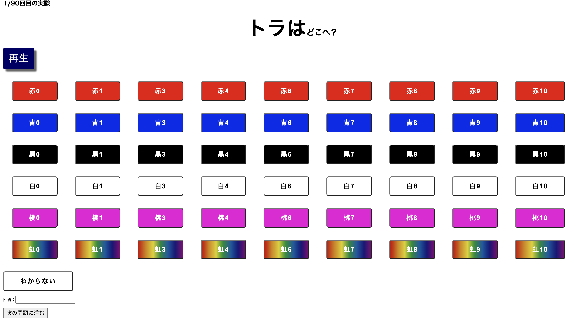

# CocktailParty Experiment System

 
このレポジトリはカクテルパーティ効果の実証実験システムとなっています．
カクテルパーティー効果とは多くの音の中から、自分が必要としている情報や重要な情報を無意識に選択することができる脳の働きのことを指します．
それを実証するために作られたのが，こちらのレポジトリのシステムです．
 
# DEMO
 
以下の画像が主な実験画面となっています．
再生ボタンを押すと，2つの音声が重なったものが流れます．その音声の内容は「{動物}が{色}の{番号}へ」というものです．
上に「{動物}はどこへ？」という文章が出るので，その動物がどこに行ったのかに当てはまるボタンを押します．
すると，左下の回答の部分にその色と番号のテキストが出るので，それでよければ「次の問題に進む」ボタンを押します．これを何回も繰り返していきます．

  

 
# Method
 
このシステムでは，自分の声やそれに似た声は聞きやすいという仮説を実証するために作られました．
そのため，被験者に様々な文章を読んでもらい，それを重複するように再生することで自分の音声と他の音声を聞き分けられるのかを判断します．
このことから実験手順は以下のように進んでいきます．

1. 実験内容の説明
2. 音声の大きさ調整
3. 練習実験（10回実施）
4. 本番実験（90回実施）
5. 印象実験（21回実施）
6. アンケート

URLにアクセス後，以上の手順を進めていってもらう形となります．
 
# Requirement

本システムを使用する場合は，以下のモジュールが必要となります．
* python-dotenv
* Pandas
* boto3

また，サーバーにはWebサーバーとしてNginxを入れ，NginxとFlaskを連携するためのインタフェースとして，gunicornを入れる必要があります．
AWSのEC2を使う場合は以下のサイトが非常に参考になるのでこちらを参照ください．
https://zenn.dev/century/articles/6b7d6ad29605f8

# Installation

以上のモジュールをインストールする場合は，requirements.txtにパッケージ名を記載し，以下をベースディレクトリにて実行ください．

    pip install -r requirements.txt
 
# Usage

使用方法は，音声ファイルの準備とサーバー上へのファイルの納入が必要となります．
音声ファイルは，複数の音声が重なって聞こえるような音声が必要となります．
Matlabなどで作成できますので，そちらを使用して準備してください．

その後，上述のサイト（https://zenn.dev/century/articles/6b7d6ad29605f8）
にアプリの実行方法まで書いてますのでそちらを参考に実行してください．
 
# Note
注意点は3点あります．

１点目は，データの送付先です．
今回は実験結果の納入先としてAWSのS3を使用しました．そのため，実験を行う前にご自身のS3のアクセスキーを作成し，そちらに変更するようお願いします．
ただ，こちらのサーバー上にも実験結果のファイルが残るように設定していますので，それで十分な場合は該当部分を削除してください．

２点目は，実験回数についてです．
今回のシステムでは，実験回数を先述のように決めています．これは，実行回数でHTMLでflaskのアプリケーションの遷移先を変更するように設定しています．
具体的には"templates"フォルダ内のpractice2.html(練習実験），experiment2.html（本番実験），quationnaire2.html（印象実験）の実験回数の場所を変更してもらえれば大丈夫です．

3点目は，音声ファイルの納入先です．
各実験において，音声ファイルを入れる場所とその形式を以下のように決定しています．（{数値}と書かれた場所に何回目の実験の数値なのかを入れてください．）
練習実験のファイルを入れる場所は，"integrated_voice/practice/{数値}"
本番実験のファイルを入れる場所は，"integrated_voice/experiment/{被験者ID}_{数値}"
印象実験のファイルを入れる場所は，"integrated_voice/impression/{被験者ID}_{数値}"
 

 

 
